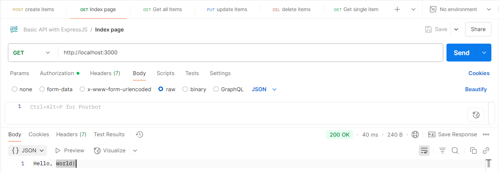
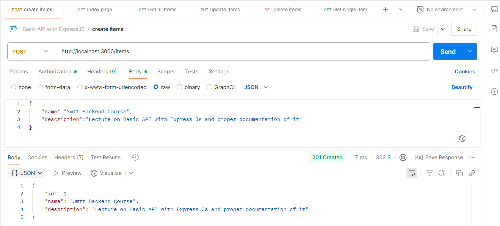
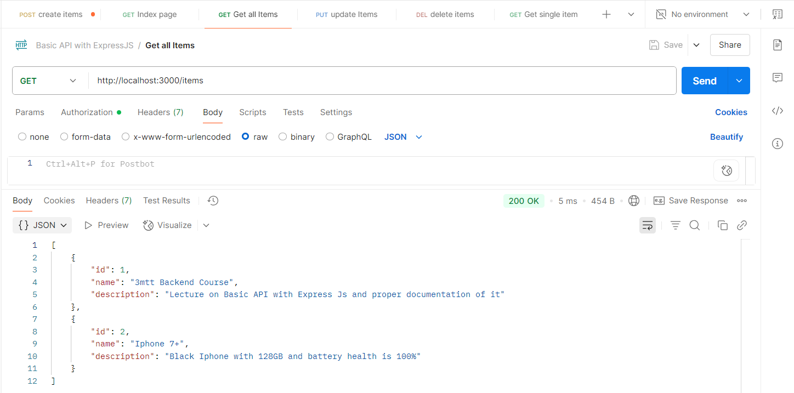
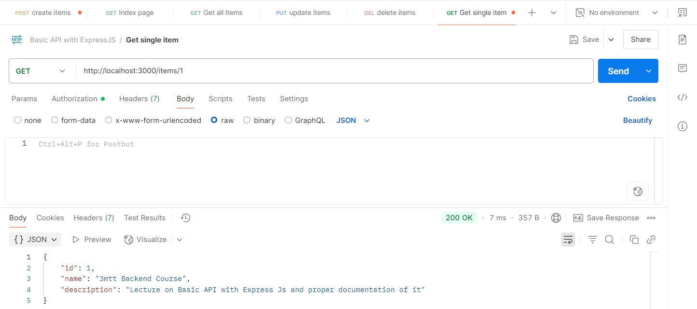
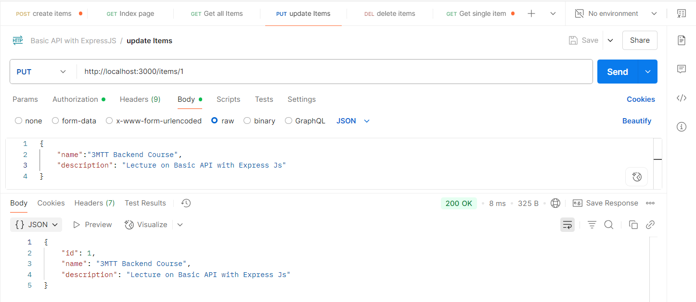
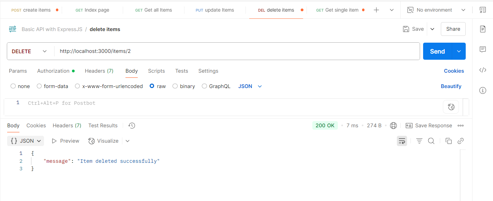

# Simple REST API with Express.js

## Objective

This project demonstrates a basic RESTful API built with Express.js and Node.js. It includes a simple in-memory data store and full CRUD functionality for managing items.

---

## Project Structure
<pre>
Restful_API_with_Express/
├── index.js           # Main application file
├── package.json       # Project metadata and dependencies
└── README.md          # Project documentation
</pre>

---

## Task Breakdown
1. Setting Up the API
- Create a basic Express.js application
- Define a route for the root URL ("/")that returns a "Hello, World!" message
- Implement error handling for invalid routes
- Set up proper middleware (e.g., express.json() for parsing request bodies)

2. Creating Routes Implement the following CRUD operations:
- GET /items - Retrieve all items
- GET /items/:id - Retrieve a single item by ID
- POST /items - Create a new item
- PUT /items/:id - Update an item by ID
- DELETE /items/:id - Delete an item by ID

3. Data Management
- Create a simple in-memory data store (array) to manage items
- Each item should have at least: id, name, and description
- Implement proper validation for incoming data

4. Error Handling
- Implement appropriate error responses (400,404,500)
- Return meaningful error messages
- Validate request parameters and body data

5. Testing
- Provide example API request using tools like Postman

## Features

- Basic Express.js setup
- Root route that returns "Hello, World!"
- Full CRUD operations:
  - Create, Read, Update, Delete `/items`
- In-memory data store (array-based)
- Input validation
- Error handling for 400, 404, and 500 responses
- Middleware for JSON parsing

---

## Installation

1. Clone or download the repo:

   ```bash
   git clone https://github.com/tosmel2/3MTT_DAREY/express-rest-api.git
   cd Restful_API_with_Express
   ```
2. Install dependencies:
    ```bash
    npm install
    ```
3. Start the server:

```bash
node index.js
Visit: http://localhost:3000
```
### API Endpoints
- GET /    ===================================>  Entry page<br>
Returns: "Hello, World!"

- POST /items
Body: 
```bash
{ 
    "name": "Item 1", 
    "description": "Description here" 
}
```

- GET /items
Returns all items
```bash
[
  {
    "id": 1,
    "name": "Sample Item",
    "description": "This is a test item."
  }
]
```

- GET /items/:id
Returns a single item by ID
```bash
{
  "name": "Item Name",
  "description": "Item Description"
}
```

- PUT /items/:id
Body: 
```bash
{
  "name": "Updated",
  "description": "Updated Description"
}
```
- DELETE /items/:id
Deletes an item


### Items CRUD
| Method | Endpoint     | Description                  |
| ------ | ------------ | ---------------------------- |
| GET    | `/items`     | Retrieve all items           |
| GET    | `/items/:id` | Retrieve a single item by ID |
| POST   | `/items`     | Create a new item            |
| PUT    | `/items/:id` | Update an item by ID         |
| DELETE | `/items/:id` | Delete an item by ID         |


## Postman Testing

1. Access index page (Entry page).


2. Create an items


3. Get all Items.


4. Get single Item


5. Update items.


6. Delete Items
